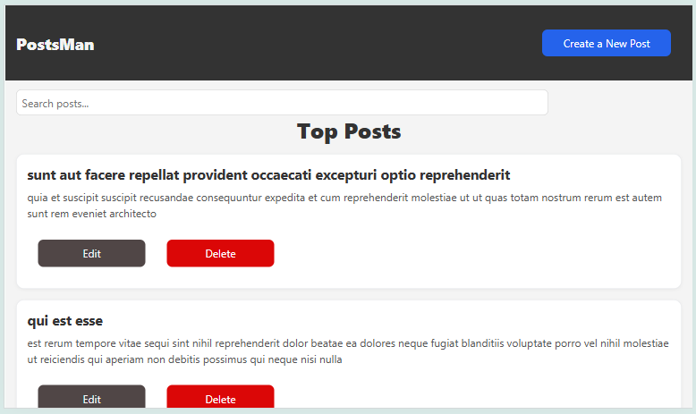
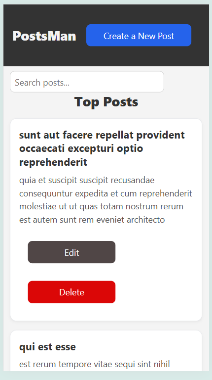

# Posts Manager App

A React + TypeScript application for managing posts with full CRUD functionality using the JSONPlaceholder API.

This project was built as part of a React Developer assessment for Titanium Training Limited.

## Features
- Fetch & display posts (GET /posts?_limit=10)
- Create a new post (POST /posts)
- Update an existing post (PUT /posts/:id)
- Delete a post (DELETE /posts/:id)
- Strong typing with TypeScript (no any)
- Clean separation of pages, services, and types
### Bonus
- Search functionality
- Error handling and loading states
- Conditional form to create a post
- Inline edit form to only show when edit button is clicked
- Responsive design

## Tech Stack
- React 18 (with Vite)
- TypeScript
- React Router
- Axios for API requests
- JSONPlaceholder API
- CSS for styling

## Installation & Setup
1. Clone the repository:
```bash
git clone https://github.com/queenhabeebah/post-manager-app.git
```
2. Install dependencies:
```bash
npm install
```
3. Start the development server
```bash
npm run dev
```
## Screenshots




## Future Improvements
- Pagination
- Unit tests (React Testing Library)
- Toast notifications for success/error

## Author
#### Habeebah Aleilo
- [Github](https://github.com/queenhabeebah)
- [LinkedIn](https://linkedin.com/in/habeebah-aleilo)
